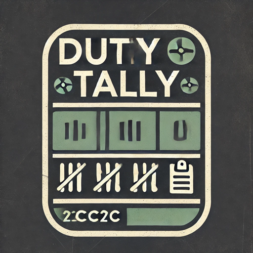

# Duty Tally

  

## Overview
Duty Tally is a lightweight RimWorld mod that adds a "Workload" column to the Work tab, showing a score based on the work types assigned to each colonist. This helps you balance work assignments across your colony and quickly identify colonists who may be overworked or underutilized.

## Features
- **Workload Column**: Adds a new column to the Work tab showing a workload score.
- **Sortable**: Click the column header to sort colonists by workload
- **Weighted Scoring**: Optionally calculate workload based on task priority. The weighting range and formula (`Max(1, MaxPrioritySetting - Priority)`) are configurable in Mod Settings (defaulting to P1=3, P2=2, P3=1, P4=1), or you can use a simple count.
- **Vanilla-Friendly**: Seamlessly integrates with RimWorld's UI
- **Configurable**: Option to ignore invisible work types (e.g., from other mods)

## Screenshots
When installed, you'll see a new "Workload" column in your Work tab that shows a score representing the work assigned to each colonist:

## Installation
1. Subscribe to the mod on [Steam Workshop](https://steamcommunity.com/workshop/filedetails/?id=3453334436)
2. Or download the latest release from GitHub and extract it to your RimWorld/Mods folder
3. Enable the mod in the game's Mod menu
4. Start or load a game
5. Check the Work tab to see the new Workload column

## Languages
Currently supported languages:
- English
- German (Deutsch)

Contributions for additional translations are welcome!

## Compatibility
- Compatible with RimWorld 1.5
- Requires Harmony
- Should work with most other mods that modify the Work tab
- No known conflicts

## FAQ
**Q: Can I add this to an existing save?**  
A: Yes, it's safe to add or remove from existing saves.
It's just UI customization.

**Q: How is the workload score calculated?**
A: By default, it uses a weighted sum based on task priority, configurable via the 'Max priority for weighting' setting (default is 4, resulting in P1=3, P2=2, P3=1, P4=1). The weight is calculated as `Max(1, MaxPrioritySetting - Priority)`. You can switch to a simple count of assigned tasks or adjust the weighting range in the Mod Settings.

**Q: Why is the number not correct?**
A: By default, the mod counts all work types, including those not normally visible in the work tab (like 'Finish Off' from the 'Allow Tool' mod). You can change this behavior in the mod settings by enabling the "Ignore invisible work types" option.

## Contributing
Contributions are welcome! Feel free to submit pull requests or open issues on GitHub.

## License
This project is licensed under the MIT License - see the [LICENSE](LICENSE) file for details.

## Credits
- Created by @mrclrchtr
- Uses Harmony for patching game code
